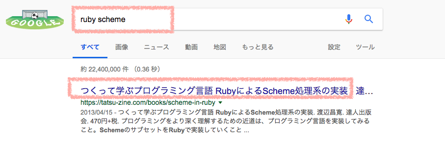
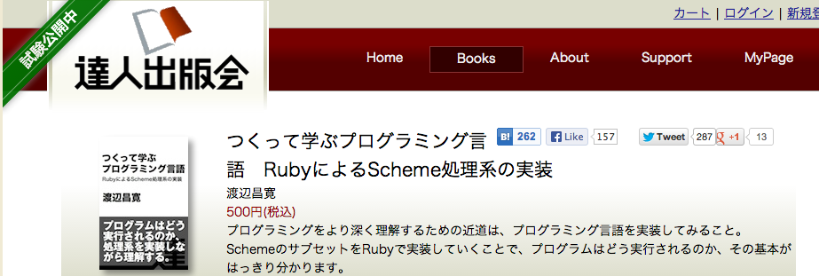
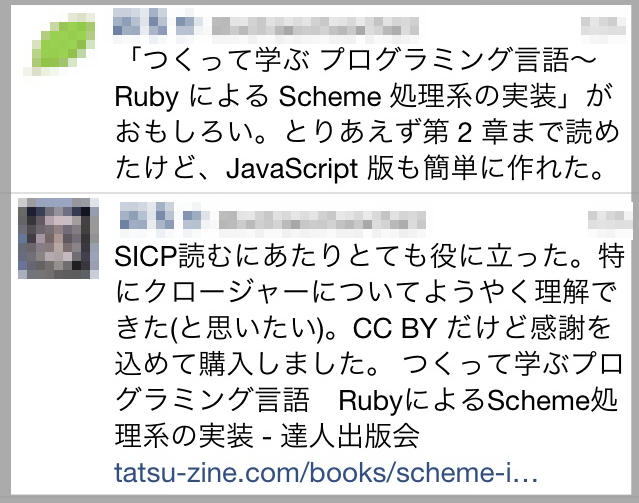
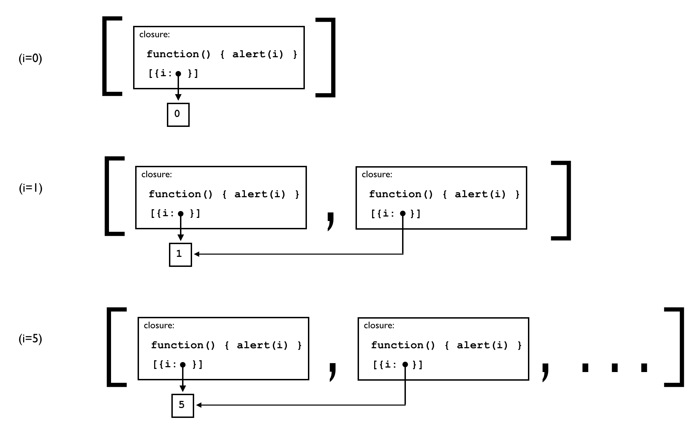
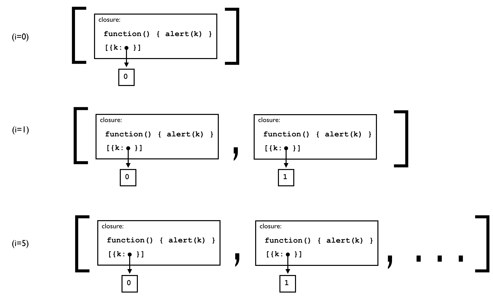
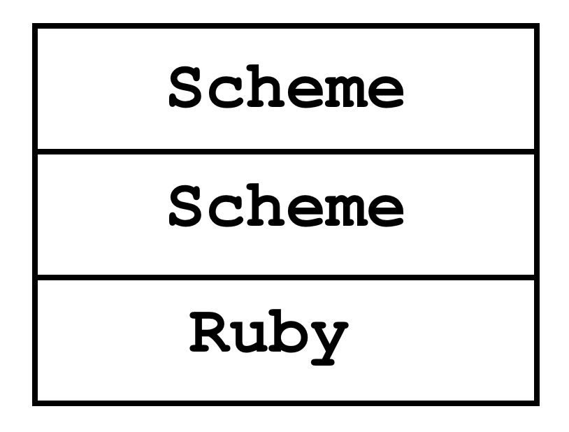

title: 自己紹介
class: big

* 名前: 渡辺昌寛
* 勤務先: 品川
* 業務: 研究開発的な部署で雑なプログラムを書きつづける
* 業務経験のトピック: MIT Media Lab. 共同研究 (1.5年)
* <strong>幕張歴: 18年</strong>

---

title: TL;DR
class: big
content_class: flexbox vcenter

* プログラミング言語を理解する近道は、プログラミング言語を実装してみること
* RubyでSchemeというプログラミング言語のインタープリタを作る → プログラムはどう実行されるかわかる
* Googleで「Ruby Scheme」で検索して、本を読んで理解しよう!
    
    

---

title: 何が、出力されるか、分かりますか?
class: big

<pre class="prettyprint" data-lang="javascript">
fnArray = [];
for (var i = 0; i < 5; i++) {
　　fnArray.push(function() { alert(i) });
}
for (var j = 0; j < 5; j++) { fnArray[j](); }
</pre>

---

title: 予想と合ってましたか?
subtitle: どうしてこうなるか説明できますか?
class: big

<pre class="prettyprint" data-lang="javascript">
fnArray = [];
for (var i = 0; i < 5; i++) {
　　fnArray.push(function() { alert(i) });
}
for (var j = 0; j < 5; j++) { fnArray[j](); } // <strong>5, 5, 5, 5, 5</strong>
</pre>

---

title: ちなみに...
subtitle: 0～4を表示したい場合
class: big

<pre class="prettyprint" data-lang="javascript">
fnArray = [];
for (var i = 0; i < 5; i++) {
　　fnArray.push(function<strong>(k)</strong>{
　　　　return function(){ alert(k); }}<strong>(i)</strong>);
}
for (var j = 0; j < 5; j++) { fnArray[j](); } // <strong>0, 1, 2, 3, 4</strong>
</pre>

---

title: クロージャ
class: big

* 上のプログラムは、クロージャを理解する必要がある
* クロージャとは?
* イマドキのプログラミング言語ではファーストクラスで使える

---

title: 本を書いた経緯
class: big

* 優れた技術者でも受けた教育の背景は多様
    * この辺(計算機科学)の知識がアヤしい人がいる
* クロージャなど計算機科学の基本を知ってもらいたい
* 最初は会社の勉強会用資料に
* 達人出版会さんのご厚意で出版  &#x1f64f;
    * しかもCC BYで!(後述)

---

title: 本を読めば
class: big

* プログラミング言語とは何かを深く理解することで、<strong>プログラミングのレベルが上がる</strong>。
* “この言語が良い!”と言う時に、<strong>シンタックス、ライブラリ、プログラミング言語固有の機能など、どのレベル</strong>の機能に言及しているの<strong>か区別できる</strong>。
* <strong>プログラムがどのように実行されるか</strong>理解できる。
* <strong>関数型言語の中心となる概念</strong>を理解できる。
* <strong>λ式とクロージャの違い</strong>が説明ができる。
* 計算機科学の良書である<strong>SICP</strong>という本を読む準備ができる。
    * Structure and Interpretaion of Computer Programs 2nd ed.: 訳本 計算機プログラムの構造と解釈 第2版 
    
* 友達に<strong>“関数型言語の処理系を作ったことがある”</strong>と言える &#x1f609;

---

title: なぜプログラミング言語を理解するために処理系を作るのか?
class: big

* <strong>ものごとの本質を理解</strong>するには、その<strong>内部がどうなっているのかを理解</strong>することが最も大切だと信じているから
* <strong>内部を理解する</strong>ためには、<strong>実際に作る</strong>ことが一番
    * Scheme(のサブセットの処理系)をRubyで作る

---

title: なぜSchemeか?
subtitle: なぜ関数型言語か?
class: big

* 作成が簡単にも関わらず強力な機能を持っていること
* なじみが少ないパラダイムである関数型のプログラミング言語を理解することにより、プログラミングの知識に幅を持てるようになる

---

title: なぜRubyで作るのか?
class: big

* 多くの人が親しんでいる手続き型言語
* 機能も強力なため、本質的なことを簡潔に説明するのに役立つ

---

title: その他: CC BYで提供
class: big

* CC BY とは?
    * CC: Creative Commons
    * > クリエイティブ・コモンズは、私たちのウェブサイトで<strong>無料</strong>でライセンスのセットを世界に提供することによって、作品を共有したいという気持ちを人々が表現する手助けをしようと考えています。 ([FAQ](https://creativecommons.jp/faq/)より)
    * CC BYライセンスの要約: [https://creativecommons.org/licenses/by/3.0/deed.ja](https://creativecommons.org/licenses/by/3.0/deed.ja)
* (渡辺によるテキトーな)意訳
    * クレジット(氏名、作品タイトル、変更の有無など)を表示さえすれば、改変、再配布、商用利用が可能
* 社内勉強会などなどでバンバン使ってください

---

title: 反応
class: big

---

title: まとめ(TL;DRの再掲)
class: big
content_class: flexbox vcenter

* プログラミング言語を理解する近道は、プログラミング言語を実装してみること
* RubyでSchemeというプログラミング言語のインタープリタを作る → プログラムはどう実行されるかわかる
* Googleで「Ruby Scheme」で検索して、本を読んで理解しよう!
    
    

---

title: ちなみに
class: segue dark nobackground

---

title: クロージャとは何か
class: big

* <strong>λ式(コード)</strong>と<strong>環境</strong>のペア
    * <strong>環境</strong>: 変数とそれに<strong>束縛</strong>された値の組のリスト
    * クロージャの環境は、λ式の<strong>評価</strong>時の環境
    * クロージャの<strong>関数適用</strong>は、クロージャ中の環境を仮引数を引数に束縛して拡張した上で、λ式を<strong>評価</strong>する
* <strong>評価</strong>とは? <strong>関数適用</strong>とは? <strong>束縛</strong>とは?...
* 本を読もう!

---

title: すべて5が表示される場合
subtitle: クロージャの環境のiが共通、かつ、副作用で値が変わる
class: big

<pre class="prettyprint" data-lang="javascript">
fnArray = [];
for (var i = 0; i < 5; i++) {
　　fnArray.push(function() { alert(i) });
}
for (var j = 0; j < 5; j++) { fnArray[j](); } // <strong>5, 5, 5, 5, 5</strong>
</pre>

---

title: 0～4が表示される場合
subtitle: 仮引数と値で環境を拡張 → 関数適用時の仮引数の値が各々で保持
class: big

<pre class="prettyprint" data-lang="javascript">
fnArray = [];
for (var i = 0; i < 5; i++) {
　　fnArray.push(function<strong>(k)</strong>{
　　　　return function(){ alert(k); }}<strong>(i)</strong>);
}
for (var j = 0; j < 5; j++) { fnArray[j](); } // <strong>0, 1, 2, 3, 4</strong>
</pre>

---

title: さらなるマニアへ
class: segue dark nobackground

---

title: Scheme in Scheme in Rubyにチャレンジ!
class: big

* 作ったScheme処理系でSchemeの処理系を作る
    * セルフホスティングと呼ばれる
* 関数型言語のプログラミング方法が学べる
* なぜ、本のRubyプログラムがこんな書き方で書かれていたかが分かる
    * RubyとSchemeがほぼ1 vs 1に対応
* Schemeの強力さが分かる
    * Rubyより短い
* 本の最新版を [https://github.com/ichusrlocalbin/scheme_in_ruby](https://github.com/ichusrlocalbin/scheme_in_ruby) (本の<strong>はじめに</strong>の章の末尾にURLが記載されています) から取得 → 付録 A にコードが記載

